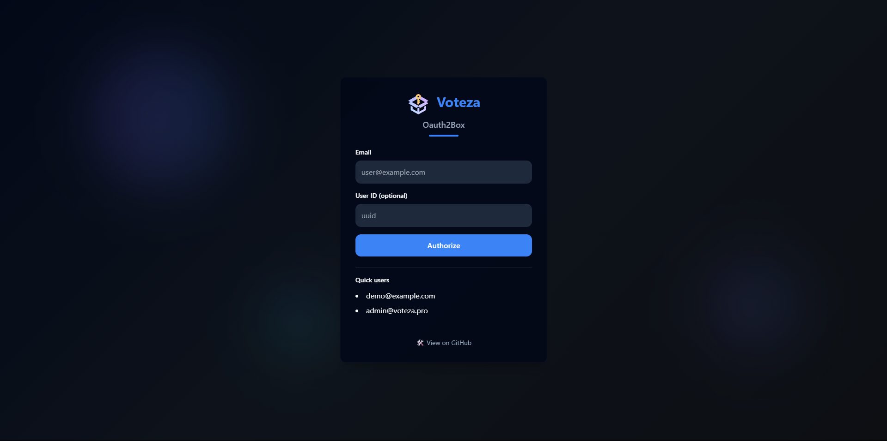

# 🗝️ Voteza OAuthBox

**OAuthBox** — это лёгкий, настраиваемый mock OAuth2/OpenID провайдер для разработки и тестирования.  
Он эмулирует поведение настоящей OAuth2-системы, позволяя легко тестировать клиентские приложения **без настоящих авторизаций**.




---

## 🚀 Возможности

- 🌐 Эмуляция `/authorize`, `/token`, `/userinfo`, `/refresh_token`
- 📥 Ввод email и user_id вручную или выбор из списка заранее заданных пользователей
- 🔁 Генерация access/refresh токенов с настройкой TTL
- 🔐 JWT на `access_token` с `sub`, `email`, `exp`, `iat`, `iss`
- 🧪 Поддержка любых `client_id` / `client_secret` (по умолчанию, но можно включить жёсткую проверку)
- 📦 Docker-ready: `docker compose up -d` и готово!

---

## 🧭 Быстрый старт

```bash
git clone https://github.com/kalininDanil17Y/Voteza-Oauth2Box.git
cd oauthbox
cp .env.example .env
docker compose up -d
```

### Строгая проверка клиентов

При установке `STRICT_CLIENTS=true` в `.env` сервер будет проверять `client_id`, `client_secret` и `redirect_uri`.
Разрешённые клиенты перечислены в файле `data/clients.json`:

```json
[
  {
    "id": "demo-app",
    "secret": "demo-secret",
    "redirect_uri": "http://localhost:3000/callback"
  }
]
```

Если `STRICT_CLIENTS=false`, сервер принимает любые значения.
